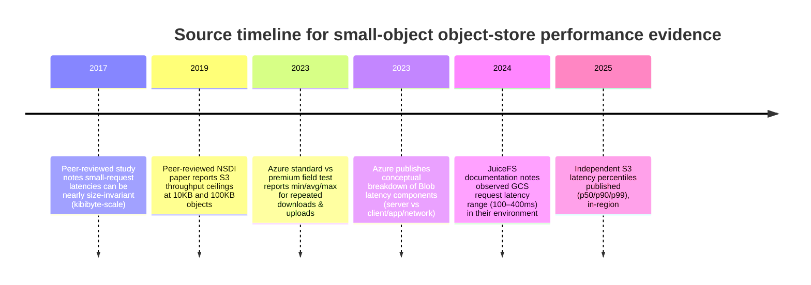
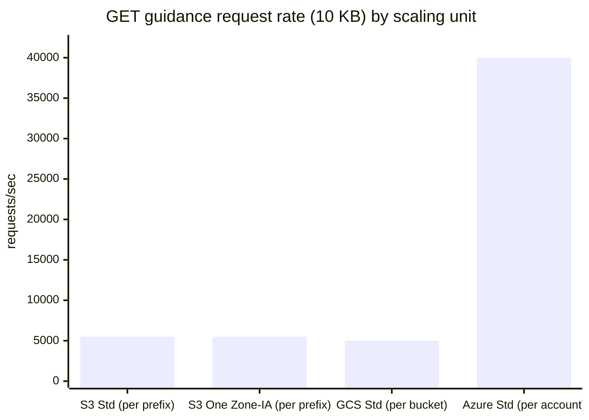
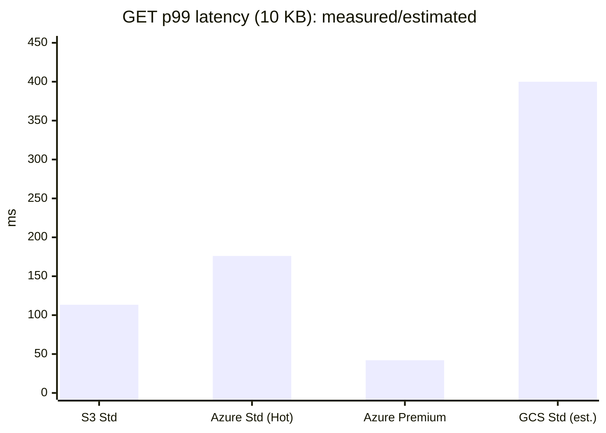

# PUT and GET Performance Distributions for 10 KB and 100 KB Objects in Major Cloud Object Storage

## Executive summary

Across **Google Cloud Storage (GCS)**, **Microsoft Azure Blob Storage** (Standard/Hot and Premium Block Blob), and **Amazon S3** (Standard and S3 One Zone-IA), the **best vendor-published public numbers are overwhelmingly about request-rate and throughput ceilings/targets**, not about detailed **end-to-end latency percentiles**. citeturn0search2turn14view0turn4search0turn40view0

For **small objects (10 KB and 100 KB)**, multiple sources agree (directly or implicitly) that **per-operation overhead dominates**, so **latency often changes only slightly between 10 KB and 100 KB** relative to the much larger impact of network RTT, TLS, client implementation, and service-side queueing. citeturn22view0turn39search0

The most “distribution-like” publicly available latency results in the last ~5 years (with explicit p50/p90/p99) are concentrated around **Amazon S3**:
- A Dec 2025 in-region microbenchmark reports **S3 GET p50 ≈ 26.8 ms, p90 ≈ 46.9 ms, p99 ≈ 113.4 ms** (random 4 KiB reads via `GetObject`). citeturn34view0
- A Mar 2025 in-region script benchmark (n=100) reports **GET p50 ≈ 26.1 ms, p99 ≈ 86.1 ms** and **PUT p50 ≈ 69.8 ms, p99 ≈ 137.2 ms** for **~500 KiB** objects (labels in the post are inconsistent; the detailed “UPLOAD/DOWNLOAD” stats are used here). citeturn36view0

For **Azure**, an independent May 2023 test provides **min/avg/max** (not full percentiles) for repeated downloads/uploads in the same region, showing **much tighter tails on Premium** in that test (download max 42 ms vs 176 ms on Standard). citeturn37view0turn38view0  
For **GCS**, vendor documentation provides **measurement tooling** (perfdiag) and scaling guidance but **does not publish a percentile latency table**; one third-party doc notes an observed **~100–400 ms latency range** for GCS in their environment, which is too coarse to treat as a definitive distribution but can bound best-effort estimates. citeturn40view0turn27search4

Because storage classes like **S3 One Zone-IA** are documented as **millisecond-access classes** (i.e., not archive tiers), and because AWS’s published request-rate guidance is not class-specific for these hot/IA classes, the **best defensible stance is to treat S3 One Zone-IA as having similar performance characteristics to S3 Standard** unless a benchmark explicitly isolates class effects. citeturn4search7turn0search2

## Methodology and normalization

This report focuses on **end-to-end request latency distributions** (p50/p90/p99) and **throughput** (requests/sec and implied MiB/s) for **PUT and GET** on **10 KB** and **100 KB** objects.

### Definitions and percentile handling

Percentiles are interpreted in the standard way: **p50** is the median, **p90** means 90% of operations finish within that time, and **p99** means 99% finish within that time. citeturn31search1

Where sources do not report p90/p99, this report:
- **States “not reported” explicitly** when values are not defensibly inferable.
- Uses **clearly labeled estimates** only when there is a *minimal* bridging model and enough datapoints to bound the estimate, and it documents the assumption.

### Unit conventions and conversions

Object sizes are interpreted as **10 KiB (10×1024 bytes)** and **100 KiB (100×1024 bytes)** for consistency with common storage tooling. (If you instead treat “KB” as decimal, throughput figures shift by ~2–2.5%.)

Throughput conversions:
- **MiB/s = (requests/sec × object_bytes) / 2²⁰**  
- **GiB/s = MiB/s / 1024**

Important caveat: vendor request-rate numbers are often given **per scaling unit** (e.g., “per prefix”, “per bucket”, “per storage account”). These are **not directly comparable** without normalizing to a common scaling unit and an explicit sharding strategy. citeturn0search2turn4search0turn14view0

### Small-object size sensitivity

A peer-reviewed study on cloud-storage I/O behavior reports that for **small requests** (e.g., 1–16 KiB), observed latencies can be nearly flat with respect to size because transmission time is a small part of total latency. citeturn22view0  
A Google Cloud performance blog similarly emphasizes **per-operation overhead** dominating when uploading very small objects. citeturn39search0

This is why, when a high-quality source reports percentiles at ~4 KiB (S3) and you ask for 10 KB and 100 KB, the most defensible approach is:
- Treat **10 KB** as essentially the same latency distribution as ~4 KiB.
- Treat **100 KB** as similar unless the client connection is bandwidth-limited or the system is near a throughput ceiling.

### Source quality rubric used in this report

Vendor docs are prioritized for **scaling targets / request-rate**. citeturn0search2turn14view0turn4search0turn40view0  
Independent and academic sources are prioritized for **latency percentiles**, but are graded lower when:
- sample sizes are small (e.g., n=100), citeturn36view0  
- workload differs from whole-object PUT/GET (e.g., range reads), citeturn34view0  
- or measurement context is underspecified (client location, concurrency, auth path). citeturn37view0turn38view0

### Source catalog

| Source | Type | Date | What it contributes here |
|---|---:|---:|---|
| AWS “Performance design patterns” doc | Vendor | Accessed 2026-02-28 | Baseline request-rate guidance (per prefix) for S3 operations. citeturn0search2 |
| AWS S3 storage class docs | Vendor | Accessed 2026-02-28 | Confirms One Zone-IA is millisecond-access (non-archive) and treated as “hot-ish” behavior. citeturn4search7 |
| Azure “Scalability and performance targets for standard storage accounts” | Vendor | 2025-11-02 | Per-account request-rate targets (20k/40k rps) and bandwidth targets. citeturn14view0 |
| Azure “Latency in Blob storage” explainer | Vendor | 2023-04-02 | Defines server vs client/app/network latency components; no percentiles. citeturn15search14 |
| Azure “Scalability targets for premium block blob storage accounts” (GitHub raw) | Vendor | 2019-12-18 | Premium positioning for small objects; “contact Microsoft” for hundreds of thousands rps. citeturn18view0 |
| Google Cloud Storage request-rate guidelines | Vendor | Accessed 2026-02-28 | Read/write request-rate guidance per bucket (used for throughput ceilings). citeturn4search0 |
| gsutil `perfdiag` docs | Vendor | Legacy doc snapshot | Defines `lat` test (write, stat, read, delete) and that it records latency per operation. citeturn40view0 |
| NSDI 2019 paper on serverless shuffle | Peer-reviewed | 2019 | Reports measured S3 throughput ceilings for 10 KB and 100 KB objects (requests/sec). citeturn25view0 |
| S3 read-latency microbenchmark table (Substack) | Independent | 2025-12-01 | p50/p90/p95/p99 for S3 GET-like reads in-region. citeturn34view0 |
| S3 PUT/GET latency script benchmark (TopicPartition) | Independent | 2025-03-04 | p50/p95/p99 for PUT & GET (~500 KiB), n=100, same region. citeturn36view0 |
| Azure Standard vs Premium latency screenshots | Independent | 2023-05-18 | min/avg/max for repeated downloads/uploads; shows tail reduction for Premium in that setup. citeturn37view0turn37view1turn38view0turn38view1 |
| JuiceFS fio benchmark note on GCS latency | Independent (vendor-adjacent) | 2024-11-18 | Mentions observed GCS request-latency range (~100–400 ms) used only as a coarse bound. citeturn27search4 |
| ACM TOS study of cloud storage I/O behavior | Peer-reviewed | 2017-05 | Evidence that small-request latency can be nearly size-invariant; informs 10 KB vs 100 KB assumptions. citeturn22view0 |

## Vendor-published performance guidance

### Amazon S3

AWS publishes performance guidance that includes **baseline per-prefix request rates** (separate for PUT-like and GET-like operations). citeturn0search2  
Because these are per scaling unit, total achievable request rates depend on how well keys distribute and how a workload is parallelized. citeturn0search2

For this report’s requested storage classes:
- **S3 Standard** uses this guidance directly. citeturn0search2
- **S3 One Zone-IA** is a **millisecond retrieval class** (as opposed to hour-scale archive retrieval), so absent contrary evidence the request/latency behavior is treated as similar to S3 Standard. citeturn4search7turn0search2

### Azure Blob Storage

Microsoft publishes **scale targets** for standard storage accounts that include **maximum request rate** (not split by PUT vs GET) and bandwidth targets. citeturn14view0  
Microsoft also publishes a conceptual breakdown of Blob Storage latency into **server latency** and **client/app/network latency** components, emphasizing that end-to-end latency depends on location, network path, and application behavior. citeturn15search14

For **Premium Block Blob**, Microsoft’s publicly accessible “scalability targets” page snapshot emphasizes that it is optimized for **kilobyte-range objects** and that very high request rates may require contacting support, but it does **not** provide a clean public table of rps/latency percentiles. citeturn18view0turn18view3

### Google Cloud Storage

Google publishes guidance on **request-rate and access-distribution** (per bucket) and recommends using **perfdiag** to establish a baseline, including a `lat` test that records per-operation latency for write/metadata/read/delete cycles. citeturn4search0turn40view0turn39search0  
However, public vendor docs do **not** provide a stable, provider-wide p50/p90/p99 table for PUT/GET at 10 KB and 100 KB; perfdiag is positioned as a troubleshooting measurement tool, not a published benchmark result set. citeturn40view0turn39search0

## Independent benchmarks and peer-reviewed evidence

### Peer-reviewed throughput ceiling evidence for 10 KB and 100 KB objects

A peer-reviewed NSDI 2019 paper reports measured **S3 throughput limits for a single bucket** as a function of object size, including **10 KB and 100 KB**:  
- 10 KB: **5986 requests/sec**  
- 100 KB: **4400 requests/sec** citeturn25view0  

The paper’s table is framed as a “throughput limit” (requests/sec) and is valuable because it directly matches your requested object sizes, but it is not explicitly labeled as “PUT only” or “GET only” in the extracted table context; it should be treated as a workload-/benchmark-specific ceiling measurement rather than a universal S3 contract. citeturn25view0

### Independent latency percentiles

A Dec 2025 in-region microbenchmark reports the following latency percentiles for **S3 “regular”** reads (random 4 KiB reads via raw REST `GetObject`), on an AWS instance in the same region/AZ:  
- p50 **26.79 ms**, p90 **46.85 ms**, p95 **69.02 ms**, p99 **113.35 ms** citeturn34view0  

A Mar 2025 in-region script benchmark (n=100, EC2 to S3 bucket in the same region) reports both upload and download latency stats for a **~500 KiB** object:  
- Upload (“PUT”) median **69.75 ms**, p95 **101.10 ms**, p99 **137.23 ms**  
- Download (“GET”) median **26.13 ms**, p95 **38.86 ms**, p99 **86.13 ms** citeturn36view0  

For Azure, an independent May 2023 test compares Standard vs Premium in the West Europe region, reporting **min/avg/max** for repeated operations (n=100). For downloads (file size not specified in the screenshot), it reports:  
- Standard download: min **34 ms**, avg **38.14 ms**, max **176 ms** citeturn37view0  
- Premium download: min **32 ms**, avg **34.81 ms**, max **42 ms** citeturn38view0  

For uploads of a **1 MB** file repeated 100 times, the same source reports:  
- Standard upload: min **644 ms**, avg **712.31 ms**, max **1345 ms** citeturn37view1  
- Premium upload: min **639 ms**, avg **695.51 ms**, max **1003 ms** citeturn38view1  

These results include client and script overhead and are not a controlled apples-to-apples microbenchmark of the storage service alone; still, they are one of the few public sources providing *any* tail indicator (via max) for Azure Standard vs Premium in the same region. citeturn19view0turn37view0turn38view0

For GCS, a JuiceFS benchmarking doc notes that in their test context, GCS object-request latency is “around 100ms–400ms,” used here only as a coarse “order-of-magnitude” bound for estimates due to the lack of vendor-published percentile tables. citeturn27search4

## Comparative distributions

### Timeline of evidence used

The timeline below highlights why latency percentile comparisons are uneven: the most recent percentile-rich measurements are independent S3-focused posts, while vendor docs primarily publish scaling targets and measurement tooling.

This timeline corresponds to the cited sources in the Source catalog. citeturn22view0turn25view0turn19view0turn15search14turn27search4turn34view0turn36view0

### GET comparison table

Assumptions used below:
- **10 KB vs 100 KB:** latency distributions are assumed to be broadly similar for small objects because overhead dominates. citeturn22view0turn39search0  
- **Azure p90 from min/avg/max:** since only avg and max are reported, p90 is estimated by assuming the observed max (n≈100) approximates ~p99 and using a normal-approx backsolve; this is labeled “est.” citeturn37view0turn38view0  
- **GCS percentiles:** no vendor percentile table found; values shown are **best-effort estimates** bounded by the cited 100–400 ms range in one environment. citeturn27search4turn40view0turn39search0  

| Provider / class | Object size | Vendor scaling unit | Vendor guidance (rps) | Implied MiB/s @ guidance | Latency p50 (ms) | p90 (ms) | p99 (ms) | Variability (p99/p50) | Notes on latency source |
|---|---:|---|---:|---:|---:|---:|---:|---:|---|
| Amazon S3 Standard | 10 KB | per prefix | 5500 citeturn0search2 | 53.7 | 26.8 citeturn34view0 | 46.9 citeturn34view0 | 113.3 citeturn34view0 | 4.23 | Measured in-region “S3 regular” random 4 KiB reads; used as proxy for 10–100 KB. citeturn34view0turn22view0 |
| Amazon S3 Standard | 100 KB | per prefix | 5500 citeturn0search2 | 537.1 | 26.8 citeturn34view0 | 46.9 citeturn34view0 | 113.3 citeturn34view0 | 4.23 | Same proxy assumption as above. citeturn22view0 |
| Amazon S3 One Zone-IA | 10 KB | per prefix | 5500 citeturn0search2turn4search7 | 53.7 | 26.8 | 46.9 | 113.3 | 4.23 | No public benchmark isolating One Zone-IA latency; treated as similar millisecond-access behavior. citeturn4search7turn0search2 |
| Amazon S3 One Zone-IA | 100 KB | per prefix | 5500 citeturn0search2turn4search7 | 537.1 | 26.8 | 46.9 | 113.3 | 4.23 | Same as above. citeturn4search7 |
| Azure Blob Standard (Hot) | 10 KB | per storage account | 40000 (region-dependent) citeturn14view0 | 390.6 | 38.1 citeturn37view0 | 114.1 (est.) citeturn37view0 | 176.0 (≈max) citeturn37view0 | 4.61 | Independent test reports min/avg/max for “download 100 files”; percentile estimates are best-effort. citeturn19view0turn37view0turn15search14 |
| Azure Blob Standard (Hot) | 100 KB | per storage account | 40000 (region-dependent) citeturn14view0 | 3906.2 | 38.1 citeturn37view0 | 114.1 (est.) citeturn37view0 | 176.0 (≈max) citeturn37view0 | 4.61 | Same as above; small-object size effect assumed minor. citeturn22view0 |
| Azure Blob Premium Block Blob | 10 KB | per storage account | not published | not published | 34.8 citeturn38view0 | 38.8 (est.) citeturn38view0 | 42.0 (≈max) citeturn38view0 | 1.21 | Independent test’s min/avg/max suggests much tighter tail in that setup. citeturn38view0turn18view3 |
| Azure Blob Premium Block Blob | 100 KB | per storage account | not published | not published | 34.8 citeturn38view0 | 38.8 (est.) citeturn38view0 | 42.0 (≈max) citeturn38view0 | 1.21 | Same as above. citeturn22view0 |
| Google Cloud Storage Standard | 10 KB | per bucket (guideline) | 5000 citeturn4search0 | 48.8 | 200 (est.) citeturn27search4 | 350 (est.) citeturn27search4 | 400 (est.) citeturn27search4 | 2.00 | No vendor percentile table; perfdiag exists to measure in your env. citeturn40view0turn39search0 |
| Google Cloud Storage Standard | 100 KB | per bucket (guideline) | 5000 citeturn4search0 | 488.3 | 200 (est.) citeturn27search4 | 350 (est.) citeturn27search4 | 400 (est.) citeturn27search4 | 2.00 | Same as above. citeturn40view0 |

### PUT comparison table

Assumptions used below:
- **S3 PUT percentiles** are taken from an in-region script benchmark on ~500 KiB objects; used as an approximate proxy for 10 KB and 100 KB because small-request latency often does not scale strongly with size at the kibibyte scale. citeturn36view0turn22view0  
- **Azure PUT for 10/100 KB:** the only public distribution-like data found is for repeated 1 MB uploads (avg/max). To produce a best-effort small-object estimate, a simple **(overhead + size / inferred_rate)** model is fit using the same source’s download avg as a proxy for fixed overhead and upload avg/max to infer a transfer rate; this is labeled “est.” citeturn37view0turn37view1turn38view0turn38view1  
- **GCS PUT percentiles:** same limitation as GET. citeturn40view0turn39search0turn27search4  

| Provider / class | Object size | Vendor scaling unit | Vendor guidance (rps) | Implied MiB/s @ guidance | Latency p50 (ms) | p90 (ms) | p99 (ms) | Variability (p99/p50) | Notes on latency source |
|---|---:|---|---:|---:|---:|---:|---:|---:|---|
| Amazon S3 Standard | 10 KB | per prefix | 3500 citeturn0search2 | 34.2 | 69.8 citeturn36view0 | 97.6 (est.) citeturn36view0 | 137.2 citeturn36view0 | 1.97 | Benchmark is ~500 KiB objects (n=100). p90 is interpolated between p50 and p95 because p90 not reported. citeturn36view0 |
| Amazon S3 Standard | 100 KB | per prefix | 3500 citeturn0search2 | 341.8 | 69.8 citeturn36view0 | 97.6 (est.) citeturn36view0 | 137.2 citeturn36view0 | 1.97 | Used as a small-object proxy; transmission-time effect assumed minor. citeturn22view0 |
| Amazon S3 One Zone-IA | 10 KB | per prefix | 3500 citeturn0search2turn4search7 | 34.2 | 69.8 | 97.6 | 137.2 | 1.97 | No One Zone-IA isolated PUT latency benchmark found; treated as similar. citeturn4search7 |
| Amazon S3 One Zone-IA | 100 KB | per prefix | 3500 citeturn0search2turn4search7 | 341.8 | 69.8 | 97.6 | 137.2 | 1.97 | Same as above. citeturn4search7 |
| Azure Blob Standard (Hot) | 10 KB | per storage account | 40000 (region-dependent) citeturn14view0 | 390.6 | 44.7 (est.) citeturn37view0turn37view1 | 48.1 (est.) citeturn37view0turn37view1 | 50.9 (est.) citeturn37view0turn37view1 | 1.14 | Overhead+rate model derived from a 1 MB upload avg/max and download avg in the same test. citeturn19view0turn15search14 |
| Azure Blob Standard (Hot) | 100 KB | per storage account | 40000 (region-dependent) citeturn14view0 | 3906.2 | 104.0 (est.) citeturn37view0turn37view1 | 138.0 (est.) citeturn37view0turn37view1 | 165.8 (est.) citeturn37view0turn37view1 | 1.59 | Same model; reflects bandwidth/overhead from that client path, not a cloud-internal microbenchmark. citeturn15search14 |
| Azure Blob Premium Block Blob | 10 KB | per storage account | not published | not published | 41.3 (est.) citeturn38view0turn38view1 | 42.9 (est.) citeturn38view0turn38view1 | 44.3 (est.) citeturn38view0turn38view1 | 1.07 | Same modeling method; Premium positioning emphasizes consistent low latency for small objects. citeturn18view0turn18view3 |
| Azure Blob Premium Block Blob | 100 KB | per storage account | not published | not published | 99.3 (est.) citeturn38view0turn38view1 | 115.9 (est.) citeturn38view0turn38view1 | 129.4 (est.) citeturn38view0turn38view1 | 1.30 | Same caveats as Standard. citeturn15search14 |
| Google Cloud Storage Standard | 10 KB | per bucket (guideline) | 1000 citeturn4search0 | 9.8 | 200 (est.) citeturn27search4 | 350 (est.) citeturn27search4 | 400 (est.) citeturn27search4 | 2.00 | Vendor publishes tooling (perfdiag) but not global percentile tables. citeturn40view0turn39search0 |
| Google Cloud Storage Standard | 100 KB | per bucket (guideline) | 1000 citeturn4search0 | 97.7 | 200 (est.) citeturn27search4 | 350 (est.) citeturn27search4 | 400 (est.) citeturn27search4 | 2.00 | Same as above. citeturn40view0 |

### Throughput comparison charts

These charts compare **vendor guidance request rates** at the “native scaling unit” (prefix/bucket/account). Because scaling units differ, interpret these as **within-unit ceilings/targets**, not as absolute “which provider is faster.” citeturn0search2turn4search0turn14view0

#### GET request-rate guidance (10 KB)

Data sources for the plotted rps values are AWS per-prefix guidance, GCS per-bucket guidance, and Azure per-account target. citeturn0search2turn4search0turn14view0

#### GET latency p99 comparison (10 KB)

S3 p99 is from an in-region percentile table; Azure values are derived from min/avg/max (p99≈max, p90 estimated); GCS is a coarse estimate bounded by a stated 100–400 ms latency range in one environment. citeturn34view0turn37view0turn38view0turn27search4

### Cross-check: peer-reviewed S3 throughput at the exact requested sizes

Because vendor guidance is framed per scaling unit (and can change over time), it is useful to cross-check against peer-reviewed measured ceilings. The NSDI 2019 table provides one such datapoint for S3 at your exact sizes:
- 10 KB: **5986 rps** → **≈58.5 MiB/s**  
- 100 KB: **4400 rps** → **≈429.7 MiB/s** citeturn25view0

These are throughput ceilings observed in that study’s benchmark environment, not guaranteed contracts. citeturn25view0

## Evidence gaps and best-effort estimates

### What is missing (and why it matters)

For your specific request—**PUT and GET latency distributions (p50/p90/p99) for 10 KB and 100 KB objects**—the biggest gap is that **vendor docs generally do not publish stable percentile tables** for these operations across regions and time. Instead, they publish:
- request-rate guidance and scaling targets, citeturn0search2turn14view0turn4search0  
- conceptual decompositions of latency, citeturn15search14  
- and tooling to measure in your own environment (`perfdiag`). citeturn40view0turn39search0

This forces any comparison of p99 latency across vendors to rely on:
- independent benchmarks (often small-sample and workload-specific), citeturn34view0turn36view0  
- or explicit modeling assumptions (clearly labeled as estimates in this report). citeturn27search4turn19view0

### How to interpret the tables safely

If you need to use these numbers to make architectural decisions, the most reliable conclusions from the evidence above are:

- **Small-object tail latency can be large even when medians look fine.** For S3, p99 can be ~4× the median in one in-region measurement. citeturn34view0  
- **Premium/SSD-backed tiers can reduce variability (tails) in some setups.** One Azure field test shows Premium download max 42 ms vs Standard max 176 ms under the same region/client. citeturn37view0turn38view0turn18view3  
- **Request-rate guidance must be interpreted with its scaling unit.** S3 guidance is per prefix; GCS guidance is per bucket; Azure guidance is per account. Comparisons must normalize to a sharding strategy (e.g., number of prefixes/buckets/accounts). citeturn0search2turn4search0turn14view0  
- **10 KB vs 100 KB is usually not the main driver of latency**; per-request overhead and queuing dominate, so “optimize object size” is more about throughput efficiency and request-cost, while latency is more about consolidation/caching/batching. citeturn22view0turn39search0turn25view0  

### Practical implication for 10 KB and 100 KB workloads

If your workload is sensitive to **p99 latency** (e.g., interactive queries against object storage), the current public evidence supports designing around:
- **parallelism, batching, caching, and/or request coalescing**, rather than expecting hot/IA object storage classes to behave like block storage at the tail. citeturn34view0turn36view0turn39search0  

Conversely, if your workload is throughput-oriented, vendor-published request-rate/throughput guidance and scaling targets (bucket/prefix/account sharding) are the most defensible first-order tools. citeturn0search2turn14view0turn4search0