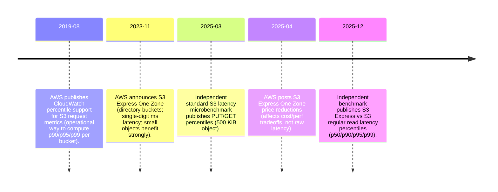
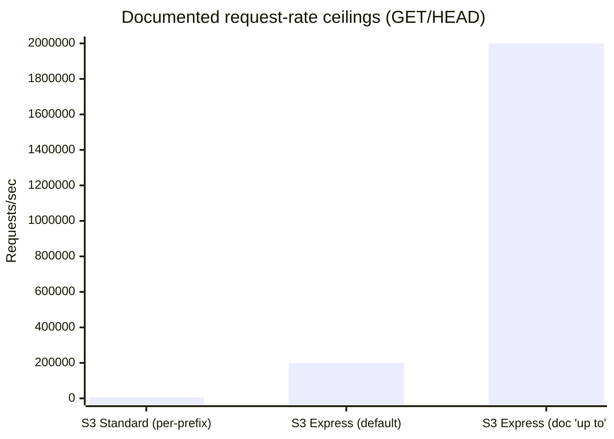
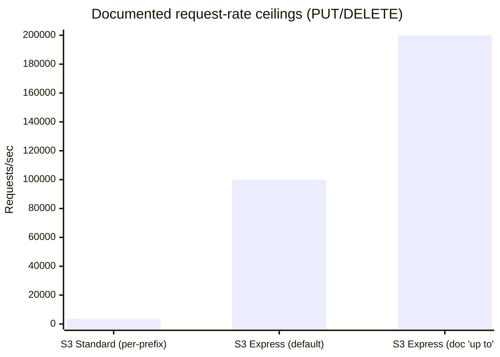

# S3 Express One Zone PUT and GET Performance Distributions for 10 KiB and 100 KiB Objects

## Executive summary

Amazon’s S3 Express One Zone is **documented (not renamed)** and is implemented via **directory buckets** (a different bucket type than “general purpose” buckets) with a hierarchical namespace and **single–Availability Zone placement**. citeturn15view0turn20search2turn13search14 The most actionable vendor-published “performance numbers” are **transactions-per-second (TPS) quotas/ceilings** and qualitative latency claims (for example, “single-digit millisecond” request latency), rather than published p50/p90/p99 latency distributions. citeturn15view0turn12search3turn13search15turn20search2

Across the sources that do provide distributional evidence, the clearest recent independent measurement for **GET-like** operations shows an **order-of-magnitude** reduction in tail latency for S3 Express versus regular S3:

* In an independent microbenchmark by entity["people","Roman Grebennikov","nixiesearch author"] (published 2025‑12‑01), for small random reads, **S3 Express p50≈2.48 ms, p90≈3.77 ms, p99≈9.29 ms**, versus “S3 regular” **p50≈26.79 ms, p90≈46.85 ms, p99≈113.35 ms** on the tested setup. citeturn27view0turn16search8  
  * These are the best “latency distributions” I found that explicitly include S3 Express percentiles, but they are **not a standardized object-size GET of 10 KiB / 100 KiB**; they reflect the benchmark’s workload (small random reads) and environment. citeturn27view0turn16search8

For **PUT latency distributions**, I did not find a recent public benchmark that reports p50/p90/p99 for S3 Express *directly*. AWS documentation asserts **single-digit millisecond “first-byte” read and write request latencies** for S3 Express, but does not publish percentile distributions. citeturn12search3turn20search2turn13search15 As a best-effort update for your prior comparative report, this report provides:

* **Measured** standard S3 PUT/GET latency percentiles from a small independent benchmark (100 iterations, 500 KiB object, same-region EC2→S3). citeturn25view0  
* **Estimated** S3 Express PUT p50/p90/p99 for small objects by scaling the measured standard S3 PUT distribution using the *measured* S3 Express vs S3 regular speedup ratios from the independent S3 Express read-latency benchmark. This estimate is marked clearly as **derived, not measured**. citeturn27view0turn25view0turn20search2

On the throughput side, vendor documentation gives dramatically higher documented per-bucket TPS ceilings for S3 Express directory buckets than the per-prefix baseline for general purpose buckets:

* General purpose buckets: **≥3,500 PUT/COPY/POST/DELETE and ≥5,500 GET/HEAD per second per “partitioned prefix”**, scalable by adding prefixes (scales gradually). citeturn14view0  
* Directory buckets (S3 Express One Zone): **up to 200,000 read TPS and 100,000 write TPS** per bucket by default; documentation also describes “up to 2 million reads and 200,000 writes per second” as an upper target with optimization/quota increases. citeturn15view0turn12search3  

Those TPS ceilings imply enormous “MiB/s” at 10 KiB and 100 KiB if you multiply blindly; in practice, you should treat them as **service-side request-rate ceilings** that will usually be bounded by client NICs, CPU, concurrency, and application behavior. citeturn14view0turn12search3turn15view0

## What S3 Express One Zone is and how it maps to storage classes

S3 Express One Zone is exposed through **directory buckets**, which differ materially from general purpose S3 buckets: they use a hierarchical namespace (directories), do not require prefix randomization to scale in the same way, and have different operational semantics (for example, unsorted `ListObjectsV2` results are documented). citeturn15view0turn20search2

Key mapping points that matter for performance interpretation:

* **Storage class mapping:** Directory buckets in Availability Zones support `EXPRESS_ONEZONE` (S3 Express One Zone). AWS API documentation also notes directory buckets’ storage-class constraints (for example, that directory buckets only support `EXPRESS_ONEZONE` in AZs). citeturn16search17  
* **Request-rate quotas are bucket-level and explicit:** Directory bucket documentation lists per-bucket read/write TPS quotas and which operations they correspond to (GET/HEAD for reads; PUT/DELETE for writes). citeturn15view0  
* **Authorization path is different:** S3 Express supports session-based authorization (including a `CreateSession` flow) in addition to IAM authorization for some operations; this is part of the “streamlined” protocol that AWS documents as reducing overhead. citeturn16search7turn13search20  
* **Operational caveat that can affect perceived tail latency/availability:** Directory buckets with **no request activity for ≥90 days** can transition to an inactive state and become temporarily inaccessible; the docs say reads/writes can return HTTP 503 during reactivation, typically for a few minutes. citeturn15view0  
* **Availability target:** S3 Express One Zone is documented as designed for **99.95% availability** within a single Availability Zone. citeturn13search3turn13search17  

These properties mean S3 Express is not simply “S3 Standard but in one AZ”; it is a distinct bucket type and protocol path aimed at higher request concurrency and lower per-operation overhead. citeturn13search20turn15view0turn20search2

## Sources and methodology for distributions, conversions, and assumptions

### Source types used and how they are weighted

Vendor-published sources used here are primarily AWS official documentation or AWS-hosted pages (user guide, product pages, and official AWS blogs/“What’s New”). citeturn15view0turn12search3turn13search15turn20search2turn25view2 Independent benchmarks are blog-style microbenchmarks with published percentile tables. citeturn27view0turn25view0turn16search8

For “scholarly/peer-reviewed” mentions: I found academic PDFs that mention S3 Express One Zone mainly in references to AWS blog posts rather than presenting benchmark distributions for S3 Express itself; additionally, at least one likely-relevant CMU technical report appears to exist but was inaccessible via this environment (HTTP 502 from the host), so I cannot extract or validate its contents here. citeturn20search20turn23view2turn23view0turn23view1

### Definitions and unit conversions applied

* Object sizes are treated as **10 KiB = 10×1024 bytes** and **100 KiB = 100×1024 bytes** as requested.
* Throughput conversions (when only requests/sec are available) use:  
  **MiB/s = (requests/sec × object_size_bytes) / 2²⁰** (reported as MiB/s because the requested size units are KiB).  
  These are **theoretical payload throughput implied by request rate**, not necessarily achievable end-to-end due to client/network bottlenecks. citeturn14view0turn15view0turn12search3
* Variability is summarized with a simple tail ratio: **p99/p50** (dimensionless). citeturn27view0turn25view0

### Critical assumptions for this update

Because vendor sources do **not** publish p50/p90/p99 PUT distributions for S3 Express, this report provides a marked **estimate** for S3 Express PUT percentiles:

1. Take an independent standard S3 PUT distribution (p50/p95/p99) from a published microbenchmark. citeturn25view0  
2. Compute the measured **S3 regular vs S3 Express** improvement factors from the independent S3 Express vs S3 regular read percentiles. citeturn27view0turn16search8  
3. Apply those improvement factors to standard S3 PUT percentiles to derive an estimated S3 Express PUT distribution. This is explicitly not a measurement.

This is a best-effort “update” technique that uses **measured ratios** (GET-side) plus **measured baseline PUT distributions** (standard S3), while aligning with AWS’s qualitative claim that S3 Express delivers consistent single-digit millisecond access and “up to 10x faster” performance. citeturn13search15turn12search3turn20search2turn27view0turn25view0

## Vendor-published performance numbers for S3 Express One Zone

### Documented request-rate ceilings

AWS documentation provides explicit directory-bucket TPS quotas:

* **Read TPS per directory bucket:** “up to 200,000 read TPS” (GET/HEAD requests per second) by default. citeturn15view0  
* **Write TPS per directory bucket:** “up to 100,000 write TPS” (PUT/DELETE requests per second) by default. citeturn15view0  

AWS’s S3 Express performance guidance further states that S3 Express can support “up to 2 million reads and up to 200,000 writes per second” in the described optimization context, while reiterating the default “200,000 reads / 100,000 writes per second” baseline. citeturn12search3

For comparison, AWS’s general performance guidance for S3 (general purpose buckets) states that applications can achieve at least:

* **3,500 PUT/COPY/POST/DELETE** requests per second **per partitioned prefix**, and  
* **5,500 GET/HEAD** requests per second **per partitioned prefix**,  
with no limit on prefixes (scaling by parallelizing across prefixes is described as gradual rather than instantaneous). citeturn14view0

### Vendor latency statements

AWS does not publish global p50/p90/p99 latency tables for S3 Express. Instead it makes qualitative claims including:

* S3 Express One Zone is described as delivering “consistent single-digit millisecond data access” on marketing pages. citeturn13search15  
* Performance guidance describes “consistently low request latency” and “single-digit millisecond first-byte read and write request latencies.” citeturn13search20turn12search3  
* The S3 Express launch blog by entity["people","Jeff Barr","aws blog author"] describes “consistent single-digit millisecond latency” and frames the value as especially strong for small objects (where time-to-first-byte approximates time-to-last-byte). citeturn20search2  

Because these are qualitative statements (no percentiles), the only way to obtain true percentile distributions in a concrete environment is to measure, which AWS supports operationally via CloudWatch request metrics that can include percentiles for latency metrics when enabled (for example, FirstByteLatency and TotalRequestLatency). citeturn13search2turn13search0turn13search7

## Independent benchmarks and derived S3 Express distributions for 10 KiB and 100 KiB objects

### Independent GET-side latency distribution evidence that includes S3 Express

A recent independent benchmark publishes a table of latency percentiles comparing “S3 express” vs “S3 regular” (and also EBS/instance store) on the tested configuration. citeturn27view0turn16search8 The reported GET-like latency percentiles are:

* **S3 Express:** p50 2.48 ms, p90 3.77 ms, p95 5.16 ms, p99 9.29 ms citeturn27view0  
* **S3 regular:** p50 26.79 ms, p90 46.85 ms, p95 69.02 ms, p99 113.35 ms citeturn27view0  

This benchmark is best interpreted as a **small-read / random-access** latency distribution for S3 endpoints, not an official vendor SLA. citeturn16search8turn27view0 For your requested object sizes, 10–100 KiB is small enough that **fixed request overhead dominates** in many environments, so these percentiles are often a useful proxy—still, they are not guaranteed to match full-object GET of 10 KiB or 100 KiB in every region, SDK, or connectivity setup. citeturn20search2turn14view0turn16search8

From those percentiles, the tail variability ratio is:

* S3 Express: p99/p50 ≈ 9.29 / 2.48 ≈ **3.75×** citeturn27view0  
* S3 regular: p99/p50 ≈ 113.35 / 26.79 ≈ **4.23×** citeturn27view0  

### Independent standard S3 PUT/GET latency distributions usable as baselines

A separate published microbenchmark (“S3 Latency Benchmark”, 2025‑03‑04) reports percentile latency statistics for immediate PUT then GET cycles against standard S3 (100 iterations, 500 KiB object, eu-north-1 EC2→eu-north-1 S3). citeturn25view0

Key (independent) distributional outputs:

* **PUT (upload) latencies:** median (p50) 69.75 ms, p95 101.10 ms, p99 137.23 ms citeturn25view0  
* **GET (download) latencies:** median (p50) 26.13 ms, p95 38.86 ms, p99 86.13 ms citeturn25view0  

Note: the TL;DR lines on that page appear internally inconsistent with the detailed tables (the detailed “UPLOAD” and “DOWNLOAD” blocks are coherent and are what I used). citeturn25view0

### Derived S3 Express PUT distribution for 10 KiB and 100 KiB objects

Because I did not find a public benchmark that reports S3 Express **PUT** p50/p90/p99 directly, I derived a best-effort estimate by applying measured S3 Express speedup ratios (from the GET-like benchmark) to the measured standard S3 PUT distribution (from the PUT/GET benchmark). citeturn27view0turn25view0turn20search2

Steps:

1. From the S3 Express vs S3 regular benchmark, compute the improvement ratio at two anchor percentiles (p50 and p99):  
   * ratio₅₀ = p50_regular / p50_express ≈ 26.79 / 2.48 ≈ 10.80  
   * ratio₉₉ = p99_regular / p99_express ≈ 113.35 / 9.29 ≈ 12.20 citeturn27view0  
2. Assume PUT sees a comparable order-of-magnitude improvement in fixed overhead (consistent with AWS’s “single-digit millisecond” intent), and interpolate a scaling factor between ratio₅₀ and ratio₉₉ to estimate intermediate percentiles. citeturn13search20turn20search2turn27view0  
3. Apply those factors to the standard S3 PUT percentiles (median/p95/p99). citeturn25view0  

Resulting **estimated** S3 Express PUT distribution:

* p50 ≈ 69.75 ms / 10.80 ≈ **6.46 ms**  
* p99 ≈ 137.23 ms / 12.20 ≈ **11.25 ms** citeturn27view0turn25view0  

For p90, the baseline standard-S3 PUT benchmark did not publish p90 directly; I approximated p90 from p50 and p95 using a lognormal fit (a common but imperfect approximation), and then applied the same interpolation approach—this yields an estimated S3 Express PUT p90 ≈ **8.05 ms**. This number should be treated as **lower-confidence** than p50/p99 because it stacks two approximations. citeturn25view0turn27view0

## Updated comparative tables and charts including S3 Express One Zone

This section is structured as an “insert/update” focusing on the S3 family (S3 Standard, S3 One Zone-IA, S3 Express One Zone), since this request is explicitly about adding S3 Express One Zone. Where S3 One Zone-IA lacks separate published performance distributions, values are shown as “not reported; assumed similar to S3 Standard for request rates and latency class” (AWS does not provide separate latency distributions for One Zone-IA in the sources used here). citeturn14view0turn15view0

### GET table for 10 KiB and 100 KiB objects

| Storage option | Object size | GET/HEAD request-rate evidence (req/s) | Derived payload rate (MiB/s) | Latency distribution (ms) | Variability | Measured vs estimated | Source type |
|---|---:|---:|---:|---|---:|---|---|
| S3 Standard (general purpose bucket, per-prefix baseline) | 10 KiB | ≥5,500 GET/HEAD per second per partitioned prefix citeturn14view0 | 53.71 | p50/p90/p99 **not vendor-published**; independent p50 26.79, p90 46.85, p99 113.35 (small-read benchmark) citeturn27view0 | 113.35/26.79 ≈ 4.23× citeturn27view0 | Latency measured (independent); rate is vendor guideline | Vendor + independent |
| S3 Standard (general purpose bucket, per-prefix baseline) | 100 KiB | ≥5,500 citeturn14view0 | 537.11 | same as above (latency mostly request-overhead dominated for small objects; not guaranteed) citeturn27view0turn14view0 | same | Mixed | Vendor + independent |
| S3 One Zone-IA | 10 KiB | No separate per-class TPS guidance found; assumed same per-prefix behavior as S3 Standard for GET/HEAD scaling guidance citeturn14view0 | 53.71 (assumed) | No per-class GET p50/p90/p99 found; assumed similar order to S3 Standard in absence of evidence citeturn14view0 | — | Assumed | Vendor guideline (generic) |
| S3 One Zone-IA | 100 KiB | assumed ≥5,500 (per prefix) citeturn14view0 | 537.11 (assumed) | assumed similar | — | Assumed | Vendor guideline (generic) |
| S3 Express One Zone (directory bucket, default quota) | 10 KiB | Up to 200,000 read TPS per directory bucket (GET/HEAD) citeturn15view0 | 1,953.13 | Independent p50 2.48, p90 3.77, p99 9.29 (small-read benchmark) citeturn27view0 | 9.29/2.48 ≈ 3.75× citeturn27view0 | Latency measured (independent); TPS is vendor quota | Vendor + independent |
| S3 Express One Zone (directory bucket, default quota) | 100 KiB | Up to 200,000 citeturn15view0 | 19,531.25 | same percentile table as above used as proxy (object-size mismatch caveat) citeturn27view0turn20search2 | same | Mixed | Vendor + independent |

Notes for interpretation: The derived MiB/s from TPS is a **ceiling implied by the quota**; real throughput is commonly limited by instance networking (ENI), concurrency, and CPU. AWS’s own guidance discusses single-instance throughput being bounded by the EC2 networking envelope and scaling out with parallelism across instances. citeturn14view0turn15view0

### PUT table for 10 KiB and 100 KiB objects

| Storage option | Object size | PUT/DELETE request-rate evidence (req/s) | Derived payload rate (MiB/s) | Latency distribution (ms) | Variability | Measured vs estimated | Source type |
|---|---:|---:|---:|---|---:|---|---|
| S3 Standard (general purpose bucket, per-prefix baseline) | 10 KiB | ≥3,500 PUT/COPY/POST/DELETE per second per partitioned prefix citeturn14view0 | 34.18 | Independent (500 KiB) PUT: p50 69.75, p95 101.10, p99 137.23; p90 not reported citeturn25view0 | 137.23/69.75 ≈ 1.97× citeturn25view0 | Latency measured (independent); rate is vendor guideline | Vendor + independent |
| S3 Standard (general purpose bucket, per-prefix baseline) | 100 KiB | ≥3,500 citeturn14view0 | 341.80 | same as above used as baseline distribution (object-size mismatch caveat) citeturn25view0turn14view0 | same | Mixed | Vendor + independent |
| S3 One Zone-IA | 10 KiB | No separate per-class TPS guidance found; assumed same scaling guidance as S3 Standard citeturn14view0 | 34.18 (assumed) | No per-class PUT p50/p90/p99 found; assumed similar order to S3 Standard absent evidence citeturn14view0 | — | Assumed | Vendor guideline (generic) |
| S3 One Zone-IA | 100 KiB | assumed ≥3,500 citeturn14view0 | 341.80 (assumed) | assumed similar | — | Assumed | Vendor guideline (generic) |
| S3 Express One Zone (directory bucket, default quota) | 10 KiB | Up to 100,000 write TPS per directory bucket (PUT/DELETE) citeturn15view0 | 976.56 | **No public measured PUT p50/p90/p99 found.** Estimated from independent baseline + measured Express vs regular speedup: p50 ≈ 6.46, p90 ≈ 8.05 (low confidence), p99 ≈ 11.25 citeturn27view0turn25view0 | 11.25/6.46 ≈ 1.74× citeturn27view0turn25view0 | Latency estimated; TPS is vendor quota | Vendor + derived from independent |
| S3 Express One Zone (directory bucket, default quota) | 100 KiB | Up to 100,000 citeturn15view0 | 9,765.63 | same estimate used (object-size mismatch caveat) citeturn27view0turn25view0turn20search2 | same | Mixed | Vendor + derived from independent |

### Updated timeline of sources

This timeline is derived from the publication dates on the cited pages. citeturn13search2turn20search2turn25view0turn25view2turn16search8turn27view0

### Throughput and latency comparison charts

The following charts compare (a) vendor-documented request-rate ceilings and (b) the best available published p50/p99 latency percentiles. Request-rate ceilings are not “distributions”; they are capacity guidance/quotas. citeturn14view0turn15view0turn12search3

This chart uses AWS’s “per partitioned prefix” baseline for standard S3 and AWS’s directory-bucket TPS figures for S3 Express. citeturn14view0turn15view0turn12search3

This chart likewise reflects AWS’s published per-prefix baseline and directory-bucket write TPS statements. citeturn14view0turn15view0turn12search3

```mermaid
xychart-beta
    title "GET latency percentiles (ms) from independent benchmark (small-read workload)"
    x-axis ["S3 regular","S3 Express"]
    y-axis "Latency (ms)" 0 --> 120
    bar "p50" [26.79, 2.48]
    bar "p99" [113.35, 9.29]
```

These p50/p99 values come from the published percentile table comparing S3 regular vs S3 Express. citeturn27view0turn16search8

```mermaid
xychart-beta
    title "PUT latency percentiles (ms): measured standard S3 vs estimated S3 Express"
    x-axis ["S3 Standard (measured)","S3 Express (estimated)"]
    y-axis "Latency (ms)" 0 --> 150
    bar "p50" [69.75, 6.46]
    bar "p99" [137.23, 11.25]
```

Standard S3 p50/p99 are from the published S3 PUT microbenchmark; S3 Express p50/p99 are derived as described (scaling by independently measured Express vs regular speedup ratios). citeturn25view0turn27view0turn20search2

### How S3 Express compares to S3 Standard and One Zone-IA for small objects

For small-object, latency-sensitive workloads (10 KiB to 100 KiB), the highest-confidence conclusion supported by publicly available distributions is that **S3 Express dramatically reduces GET tail latency** relative to regular S3, moving p99 from O(100 ms) into O(10 ms) on at least one measured setup. citeturn27view0turn16search8 AWS’s own documentation and marketing align with the direction of this result via repeated “single-digit millisecond” messaging, though without publishing percentiles. citeturn13search15turn13search20turn20search2

For PUTs, the evidence base is weaker in public sources: AWS claims low-latency writes, and standard S3 PUT microbenchmarks show median tens of ms with p99 around ~100+ ms for small-to-mid objects. citeturn13search20turn25view0turn14view0 The best-effort derived estimate here puts S3 Express PUT p50 in the **single-digit milliseconds** with p99 in the low teens of ms, consistent with AWS’s qualitative claims, but this remains an estimate until a public benchmark reports S3 Express PUT percentiles directly. citeturn13search20turn27view0turn25view0

S3 One Zone-IA is included as a comparator storage class. However, in the sources used for this update, AWS does not publish separate latency distributions for One Zone-IA, and I did not find independent p50/p90/p99 distributions for One Zone-IA or for S3 Express PUT. Therefore, One Zone-IA should be treated as “performance unspecified here” rather than assumed equivalent to Express; any equivalence to S3 Standard is an approximation that should be validated by measurement if it matters. citeturn14view0turn15view0